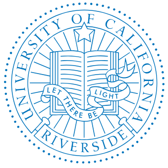

<!doctype html>
<html lang="en">
<head>
  <meta charset="utf-8" />
  <meta name="viewport" content="width=device-width, initial-scale=1" />
  <title>Fatemeh Asgarinejad — Assistant Professor of Teaching, UCR</title>
  <link rel="stylesheet" href="https://cdnjs.cloudflare.com/ajax/libs/font-awesome/6.5.0/css/all.min.css">
  
</head>
<body>
<header>
  

    

      
Fatemeh Asgarinejad

      
Assistant Professor of Teaching — Department of Electrical & Computer Engineering @ UC Riverside

    

  

  
  

    
  

  
  

    office: tbd 
    email: fatemeh.asgarinejad1@ucr.edu
  

</header>

  

    <button class="active" data-tab="about">About</button>
    <button data-tab="teaching">Teaching</button>
    <button data-tab="awards">Awards</button>
    <button data-tab="publications">Research and Publications</button>
    <button data-tab="outreach">Outreach / Service</button>
    <button data-tab="talks">Talks</button>
  

  

    

      

        
        

          <a href="https://www.linkedin.com/in/fatemeh-asgarinejad/" title="LinkedIn"><i class="fab fa-linkedin-in"></i></a>
          <a href="https://github.com/Fasgarinejad" target="_blank" title="GitHub"><i class="fab fa-github"></i></a>
          <a href="mailto:fasga001@ucr.edu" title="Email"><i class="fas fa-envelope"></i></a>
          <a href="https://www.youtube.com/@fatemehasgarinejad" target="_blank" title="YouTube"><i class="fab fa-youtube"></i></a>
        

        
      

      

      
Hi! 👋 I'm Fatemeh (“Faa-teh-meh”) Asgarinejad. Starting Fall 2025, I’ll be an Assistant Professor of Teaching in <a href="https://www.ee.ucr.edu/">Electrical and Computer Engineering Department</a> at <a href="https://www.ucr.edu/">University of California Riverside</a> :). My research explores the intersection of CS and ECE education—centering engaged, continuous learning—and uses machine learning, data science and mathematics to solve real-world problems.

        
Previously, I received my Ph.D. from the <a href="https://ucsd.edu/">University of California San Diego</a>, where I had the privilege of being advised by Professors <a href="https://cseweb.ucsd.edu/~trosing/">Tajana Rosing</a> and <a href="https://aksanli.sdsu.edu/">Baris Aksanli</a> (joint with San Diego State University). During my Ph.D., I worked on Secure, Efficient and Private Computing at the Edge with Hyperdimensional Computing, and explored its synergy with Machine Learning. I am honored to have received the <a href="https://senate.ucsd.edu/grants-awards/senate-awards/distinguished-teaching-award">2025 Barbara J. and Paul D. Saltman Excellent Teaching Award from UC San Diego</a>, as well as the <a href="https://cse.ucsd.edu/graduate/cse-department-awards">2025 Excellence in Teaching Award from the UCSD Computer Science and Engineering Department</a>.

        
<strong>Collaborations</strong>: If you are interested in collaborating with me, please contact me at <a href="mailto:fasga001@ucr.edu">fatemeh.asgarinejad1@ucr.edu</a>

        

          <strong>News</strong>: 
          July 2025: My recent work in HD Computing was recognized as one of the two top achievements in the Cocosys Spring Quarter Review. 
          May 2025: I won the UCSD CSE Department Award for Excellence in Teaching 
          May 2025: Defended my PhD! 
          May 2025: Poster accepted in Mathematics Association of America MathFest. 
          April 2025: I won the <strong>UCSD 2025 Barbara J. and Paul D. Saltman Excellent Teaching Award</strong>!
        

      

    

  

  

    <!-- University of California, Riverside -->
    <h4 class="university-heading current">University of California, Riverside</h4>
    <ul>
      <strong>Instructor</strong>, Electrical and Computer Engineering
      <ul>
        <li><strong style="color: #00629B;">EE 5</strong>: Circuits and Electronics (Fall 2025)</li>
        <li><strong style="color: #FDB515;">EE 16</strong>: Data Analysis for Engineering Applications (Fall 2025)</li>
      </ul>
    </ul>

    <!-- New cool course cards for EE 05 and EE 101 -->
    

      

        Fall 2025
        

          

            <i class="fa-solid fa-bolt course-icon" aria-hidden="true"></i>
            

              
EE 05

              
Circuits & Electronics

            

          

          <!-- 

            UCR
            Undergraduate
            Hands-on labs
          
 -->
          

            <a class="btn-link secondary" href="#" aria-disabled="true">Syllabus (TBD)</a>
            <a class="btn-link secondary" href="#" aria-disabled="true">Course Site (TBD)</a>
          

        

      

      

        Fall 2025
        

          

            <i class="fa-solid fa-chart-line course-icon" aria-hidden="true"></i>
            

              
EE 16

              
Data Analysis for Engineering Applications

            

          

          <!-- 

            UCR
            Undergraduate
            Real-World-Application-focused
          
 -->
          

            <a class="btn-link secondary" href="#" aria-disabled="true">Syllabus (TBD)</a>
            <a class="btn-link secondary" href="#" aria-disabled="true">Course Site (TBD)</a>
          

        

      

    

    
<i class="fas fa-graduation-cap"></i>

    <!-- University of California, San Diego -->
    <h4 class="university-heading ucsd">University of California, San Diego</h4>
    <ul>
      <strong>Instructor</strong>, Computer Science and Engineering
      <ul>
        <li><a href="CSE20_Summer_2024.html" class="v-box"><strong>CSE 20:</strong> Discrete Mathematics (Summer 2024)</a><a href="https://drive.rle.com/file/d/1BRmIGQutY4DPvpvFwI-xlrVUsYrCOxp1/view?usp=sharing" target="_blank" style="margin-left: 10px;">[Course Syllabus]</a></li>
      </ul>
       
      <strong>Teaching Assistant, Computer Science and Engineering</strong>
      <ul>
        <li><strong>CSE 101:</strong> Design and Analysis of Algorithms (Summer 2023)</li>
        <li><strong>CSE 20:</strong> Discrete Mathematics (Spring 2021, Spring 2022, Summer 2022, Spring 2023, Winter 2023, Winter 2025, Spring 2025)</li>
        <li><strong>CSE 21:</strong> Mathematics for Algorithms and Systems Analysis (Winter, Spring, and Fall 2024)</li>
      </ul>
       
      <strong>Teaching Assistant, Halıcıoğlu Data Science Institute</strong>
      <ul>
        <li><strong>DSC 200:</strong> Data Science Programming (Fall 2023)</li>
        <li><strong>DSC 40A:</strong> Theoretical Foundations of Data Science (Summer 2023)</li>
      </ul>
    </ul>
     

    <!-- San Diego State University -->
    <h4 class="university-heading sdsu">San Diego State University</h4>
    <ul>
      <li><strong>Instructor:</strong> First Year Seminars, four Classes (Fall 2021)</li>
    </ul>
     

    <!-- UC San Diego Extended Studies -->
    <h4 class="university-heading ucsd">UC San Diego Extended Studies</h4>
    <ul>
      <li><strong>Instructor</strong> Fundamentals of Data Science (July 2025)</li>
    </ul>
     

    <!-- UC San Diego Extension -->
    <h4 class="university-heading ucsd">UC San Diego Extension</h4>
    <ul>
      <li><strong>Teaching Assistant:</strong> DSE 220x - Machine Learning Fundamentals (Prof. Sanjoy Dasgupta, Three Semesters Sep 2019 - Aug 2020)</li>
    </ul>
     

    <h4 class="university-heading ucsd">UC San Diego Teaching Certificates</h4>
    <ul>
      <li><strong>UC San Diego Student-Centered College Teaching & Course Design Certificate</strong></li>
      <li><strong>Leadership in Teaching: Graduate Peer Review of Instruction Program Certificate</strong></li>
      <li><strong>Transparency in Learning and Teaching (TILT) Community of Practice Certificate</strong></li>
    </ul>
  

  

    <h3 class="section-heading">Publications</h3>
    <ul>
      <li><strong>F. Asgarinejad</strong>, F. Ponzina, O. Gungor, T. Rosing, B. Aksanli, "<a href="https://www.researchgate.net/profile/Onat-Gungor/publication/386284039_HDXpose_Harnessing_Hyperdimensional_Computing's_Explainability_for_Adversarial_Attacks/links/674bc8e63d17281c7deebe28/HDXpose-Harnessing-Hyperdimensional-Computings-Explainability-for-Adversarial-Attacks.pdf">HDXpose: Harnessing Hyperdimensional Computing's Explainability for Adversarial Attacks</a>", ICCAD, 2024. [<a href="https://drive.google.com/file/d/1aFNGfm4ebCrcbrD8ZCvJMOYANDoJ-V0b/view?usp=sharing">slides</a>]</li>
      <li><strong>F. Asgarinejad</strong>, F. Asgarinejad, J. Morris, T. Rosing, B. Aksanli, <a href="https://dl.acm.org/doi/abs/10.1145/3665314.3670852">VisionHD: Revisiting Hyperdimensional Computing for Improved Image Classification</a>, ISLPED, 2024.</li>
      <li>M. Gaddi, F. Ponzina, <strong>F. Asgarinejad</strong>, B. Aksanli, T. Rosing, "<a href="https://ieeexplore.ieee.org/abstract/document/10820450">HyperECG: ECG Signal Inference from Radar with Hyperdimensional Computing</a>", BIBE, 2024.</li>
      <li><strong>F. Asgarinejad</strong>, J. Morris, T. Rosing, B. Aksanli, <a href="https://ieeexplore.ieee.org/abstract/document/10473862">PIONEER: Towards Highly Efficient and Accurate Hyperdimensional Computing using Learned Projection</a>, ASP-DAC, 2024. [<a href="https://drive.google.com/file/d/1UA5_tglLJhhkm3kLhmsZYRfLL5nprNRq/view?usp=sharing">slides</a>]</li>
      <li><strong>F. Asgarinejad</strong>, A. Thomas, R. Hildebrant, Z Zhang, S. Ren. Rosing, B. Aksanli <a href="https://www.mdpi.com/2078-2489/15/8/490">Optimized Early Prediction of Business Processes with Hyperdimensional Computing</a>, MDPI Information, 2024.</li>
      <li><strong>F. Asgarinejad</strong>, X. Yu, D. Jiang, J. Morris, T. Rosing, B. Aksanli, <a href="https://www.mdpi.com/1424-8220/24/3/1014">Enhanced Noise-Resilient Pressure Mat System Based on Hyperdimensional Computing</a>, MDPI Sensors, 2024.</li>
      <li>R. Chandrasecaran, <strong>F. Asgarinejad</strong>, J. Morris, T. Rosing, <a href="https://ieeexplore.ieee.org/abstract/document/10196438">Multi-label classification with Hyperdimensional Representations</a> IEEE ACCESS, 2023.</li>
      <li>X. Yu, M. Zhou, <strong>F. Asgarinejad</strong>, O. Gungor, B. Aksanli, T. Rosing, <a href="https://ieeexplore.ieee.org/abstract/document/10247820">Lightning Talk: Private and Secure Edge AI with Hyperdimensional Computing</a>, DAC, 2023.</li>
      <li>Z. Zhang, R. Hildebrant, <strong>F. Asgarinejad</strong>, N. Venkatasubramanian, S. Ren, <a href="https://ieeexplore.ieee.org/abstract/document/9610661">Improving Process Discovery Results by Filtering Out Outliers from Event Logs with Hidden Markov Models</a>, CBI, 2021.</li>
      <li>R. Garcia, <strong>F. Asgarinejad</strong>, B. Khaleghi, T. Rosing, M. Imani <a href="https://ieeexplore.ieee.org/abstract/document/9474239">TruLook: A Framework for Configurable GPU Approximation</a>, DATE, 2021.</li>
      <li><strong>F. Asgarinejad</strong>, A. Thomas, T. Rosing, <a href="https://ieeexplore.ieee.org/abstract/document/9175328">Detection of Epileptic Seizures from Surface EEG using Hyperdimensional Computing</a>, EMBC, 2020. [<a href="https://drive.google.com/file/d/1G-7ESC-DQj2xH6xuVQStgZYvNy5kauNS/view?usp=sharing">slides</a>], [<a href="https://www.youtube.com/watch?v=ch0Mm9_5cPw">presentation</a>]</li>
      <li>B. Khaleghi, S. Salamat, A. Thomas, <strong>F. Asgarinejad</strong>, Y. Kim, T. Rosing, <a href="https://dl.acm.org/doi/abs/10.1145/3370748.3406587">SHEARer Highly-Efficient Hyperdimensional Computing by Software-Hardware Enabled Multifold Approximation</a>, ISLPED, 2020.</li>
    </ul>

    <h3 class="section-heading">Mentorship</h3>
    <ul>
      <li>Jiaying Yang, B.Sc. student in Computer Science, UCSD, Project: Addressing Catastrophic Forgetting in Neural Networks using Hyperdimensional Computing (to be submitted in Fall 2025). Summer 2024-Summer 2025</li>
      <li>Matilda Gaddi, B.Sc. student in Data Science, UCSD, Project: ECG Signal Inference from Radar with Hyperdimensional Computing (published in IEEE BIBE 2024). Summer 2023-Winter 2025</li>
      <li>A.J. Olivares, B.Sc. student in Computer Science, UCSD, Project: Addressing Catastrophic Forgetting in Neural Networks using Hyperdimensional Computing. Summer 2024</li>
      <li>Amir Kiadi, B.Sc. student in Computer Science, UCSD, Project: Adversarial Attacks in Hypedimensional Computing (submitted to TCAD 2025). Fall 2025-Spring 2025</li>
      <li>Ava Emami, B.Sc. student in Computer Science, UCSD, Project: Defense mechanisms using HDC (to be submitted in Fall 2025). Spring 2025-Fall 2025</li>
      <li>Lilianne Montehermoso, High School student, PRISM Center Research Program, Project: Analyzing Adversarial Attacks in Machine Learning (submitted to journal of students research 2025). Summer 2024-Spring 2025</li>
    </ul>
  

  

    <h3 class="section-heading">Invited Talks</h3>
    <ul>
      <li>SRC TECHCON, Research Scholar and Presenter, Sep 2025</li>
      <li>2025 Invited Seminar Series organized by IEEE Computer Society chapter of IEEE San Diego Section, Aug 2025</li>
      <li>Panelist, UCSD SRP Professional Development Forum - Graduate Student Panel (STEM), July 2025</li>
      <li>Panelist, UCSD Teaching and Learning Commons, Summer Teaching Community 2025, June 2025</li>
      <li>University of California Riverside, ECE, Logic Optimization and Multi-Level Minimization, Winter 2025</li>
      <li>Purdue University, CS, Induction and Recursion, Winter 2025</li>
      <li>California State University Long Beach, CECS, Towards Efficient Learning at the Edge by Hyperdimensional Computing, Winter 2025</li>
      <li>University of Texas Austin, CS, Clustering: K-Means, Winter 2025</li>
      <li>University of Texas A&M, CSE, Sorting Algorithms: Merge Sort, Winter 2025</li>
      <li>Chapman University, CS, Simple and Multiple Linear Regression, Winter 2025</li>
      <li>Northwestern University, Statistics and Data Science, Introduction to Hypothesis Testing and its Application in Real-Life and Data Science, Winter 2025</li>
      <li>Panelist, PRISM Center Annual Review, UC San Diego, "PRISM Center Summer Virtual High School Program", Nov 2024</li>
      <li>SRC TECHCON, "Harnessing Hyperdimensional Computing's Explainability for Adversarial Attacks", Sep 2024</li>
      <li>Colegio San Agustin-Bacolod University's 60th Founding Anniversary Research Conference, "Applying Machine Learning and Brain-Inspired Computing for Innovative Problem Solving", July 2023</li>
    </ul>

    <h3 class="section-heading">Conference Talks</h3>
    <ul>
      <li>ICCAD, 2024 [<a href="https://drive.google.com/file/d/1aoMJYb87zvwgYjKihUkDwLyLlLSKWa-a/view?usp=sharing">slides</a>]</li>
      <li>ASP-DAC, 2024 [<a href="https://drive.google.com/file/d/1UA5_tglLJhhkm3kLhmsZYRfLL5nprNRq/view?usp=sharing">slides</a>]</li>
      <li>EMBC, 2020 [<a href="https://drive.google.com/file/d/1G-7ESC-DQj2xH6xuVQStgZYvNy5kauNS/view?usp=sharing">slides</a>] | [<a href="https://www.youtube.com/watch?v=ch0Mm9_5cPw">presentation</a>]</li>
    </ul>
  

  

    <ul>
      <li>UCSD CSE Department Award for Excellence in Teaching, 2025</li>
      <li><strong>UCSD 2025 Barbara J. and Paul D. Saltman Excellent Teaching Award</strong></li>
      <li>DAC'61 Young Fellow Best Video Presentation Award, 2024</li>
      <li>DAC Young Fellow at the 61st and 62nd Design Automation Conference in San Francisco, 2024, 2025</li>
      <li>SRC Research Scholar and awarded funding for conference participation, 2024, 2025</li>
      <li>UCSD travel grant, 2024</li>
      <li>Member of HKN (Eta Kappa Nu) Honor Society of UC San Diego since May 2022</li>
      <li>Ranked 20th (top 0.1%) in Iran's national university entrance exam for M.Sc. in Computer Science, 2017</li>
      <li>Ranked top 0.4% in Iran's national university entrance exam for M.Sc. in Computer Engineering, 2017</li>
      <!-- <li>Ranked top 0.9% and top 3.4% nationwide in Iran’s national university entrance exams for B.Sc. programs in Foreign Languages and Mathematics, respectively, 2012</li> -->

    </ul>
  

  

    <h3 class="section-heading">Belonging, Diversity and Equity</h3>
    <ul>
      <li>Research Mentor (at UC San Diego, <a href="https://seelab.ucsd.edu/index.html">SEElab</a> August 2023 - Summer 2025</li>
      <li><a href="https://ucsdwic.github.io/">Women In Computing Mentorship Program (at UC San Diego)</a>, Fall 2024 - Winter 2025</li>
      <li>Research Mentor (at UC San Diego, PRISM Center), <a href=https://cse.ucsd.edu/about/news/prisms-summer-outreach-program-introduces-high-school-students-world-scientific-research">Virtual High School Research Program for high school students</a>, Summer 2024</li>
      <li><a href="https://hkn.ucsd.edu/">HKN (Eta Kappa Nu) Honor Society of UC San Diego</a> Outreach Program for middle-school and High-school students</li>
      <li><a href=https://www.learn-python.ir/">Algorithmic Creativity and Python Programming Summer School Mentor (at Sharif University of Technology)</a>, under supervision of Prof. Ali Sharifi-Zarchi, Summer 2023 (in Persian)</li>
    </ul>

    <h3 class="section-heading">Professional Service</h3>
    <ul>
      <li>Panel Moderator at the UCSD 2025 Undergraduate Summer Research Conference</li>
      <li>Reviewer for ACM Computing Surveys</li>
      <li>Student Activities Chair for IEEE San Diego Section, summer 2025 - present</li>
    </ul>

  

  
</body>
</html>
