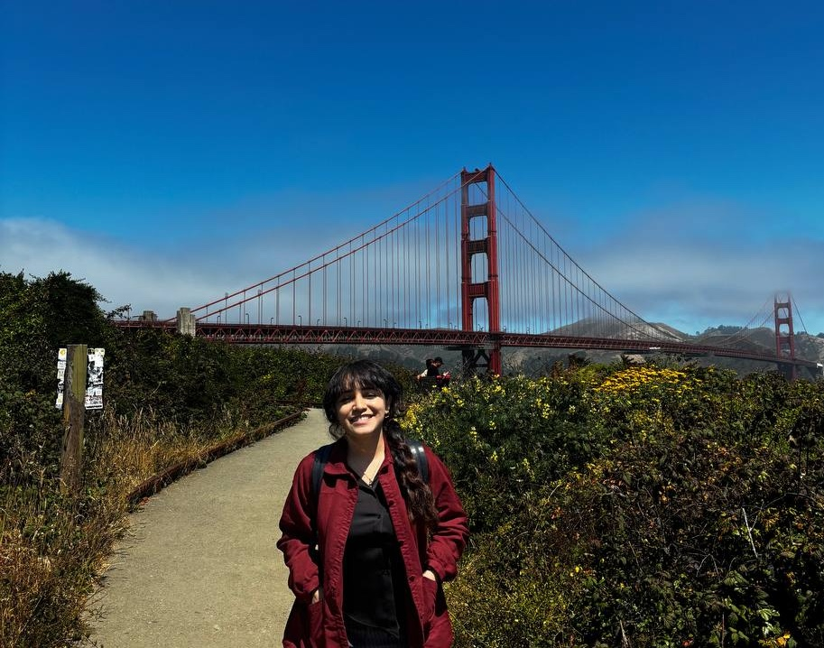
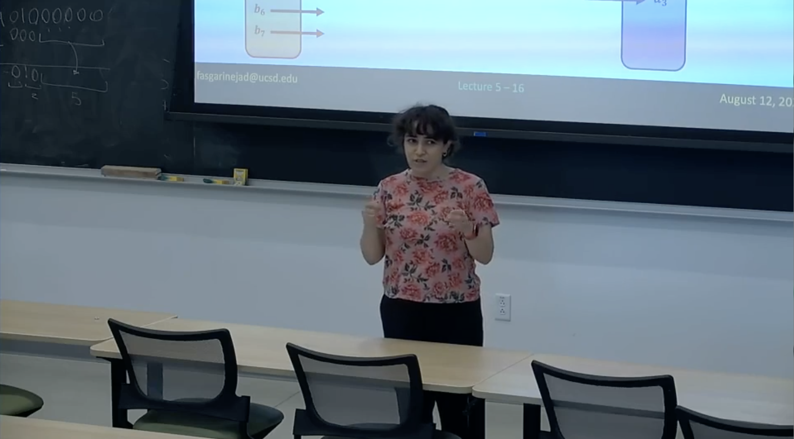

<html lang="en">
<head>
    <meta charset="UTF-8">
    <meta name="viewport" content="width=device-width, initial-scale=1.0">
    <link rel="stylesheet" href="https://cdnjs.cloudflare.com/ajax/libs/font-awesome/6.0.0-beta3/css/all.min.css">
    
</head>
<body>
    

        

            

    <!-- LinkedIn -->
    <a href="https://www.linkedin.com/in/fatemeh-asgarinejad/" title="LinkedIn">
        <i class="fab fa-linkedin-in"></i>
    </a>
    <!-- GitHub -->
    <a href="https://github.com/Fasgarinejad" target="_blank" title="GitHub">
        <i class="fab fa-github"></i>
    </a>
    <!-- Email -->
    <a href="mailto:fasgarinejad@ucsd.edu" title="Email">
        <i class="fas fa-envelope"></i>
    </a>
    <!-- YouTube -->
    <a href="https://www.youtube.com/@fatemehasgarinejad" target="_blank" title="YouTube">
        <i class="fab fa-youtube"></i>
    </a>
    <!-- Google Scholar (custom SVG logo) -->
        

            
        
 
        

            
Hi! 👋 I'm Fatemeh ("Faa-teh-meh") Asgarinejad, a fifth-year Ph.D. candidate at the Electrical and Computer Engineering department at the University of California, San Diego (joint with San Diego State University). I work on Hyperdimensional Computing Security and synergy of Hyperdimensional Computing and Machine Learning under the supervision of <a href="https://cseweb.ucsd.edu/~trosing/">Prof. Tajana Rosing</a> and <a href="https://aksanli.sdsu.edu/">Prof. Baris Aksanli</a> and I have been lucky and grateful to be mentored by them as well as <a href='https://niema.net/'>Prof. Niema Moshiri</a>.
 You can find my candidacy presentation slides from <a href="https://drive.google.com/file/d/114Abv7Jxh7koSGvKCaKKqCUU96pKq_Qa/view?usp=sharing">here</a>. 
 Sample teaching (Statistics - Hypothesis Testing) [<a href="https://www.youtube.com/watch?v=6w7PSSkKEFQ&t=1s">video</a>] [<a href="https://drive.google.com/file/d/1aFNGfm4ebCrcbrD8ZCvJMOYANDoJ-V0b/view?usp=sharing">slides</a>] 

            

                <strong>News</strong>:  
                April 2025: I won the <strong>UCSD 2025 Barbara J. and Paul D. Saltman Excellent Teaching Award</strong>! 
            

            <h3 class="section-heading">Teaching</h3>

            <!-- University of California, San Diego -->
            <h4 class="university-heading">University of California, San Diego</h4>
            <ul>
                <li><strong>Instructor</strong>, Computer Science and Engineering
                    <ul>
                        <li><a href="CSE20_Summer_2024.html" class="v-box"><strong>CSE 20:</strong> Discrete Mathematics (Summer 2024)</a>  <a href="https://drive.google.com/file/d/1BRmIGQutY4DPvpvFwI-xlrVUsYrCOxp1/view?usp=sharing" target="_blank" style="margin-left: 10px;">Course Syllabus</a></li>
                        </ul>
                </li>
                <li><strong>Teaching Assistant, Computer Science and Engineering</strong>
                    <ul>
                        <li><strong>CSE 101:</strong> Design and Analysis of Algorithms (Summer 2023)</li>
                        <li><strong>CSE 20:</strong> Discrete Mathematics (Spring 2021, Spring 2022, Summer 2022, Spring 2023, Winter 2023, Winter 2025, Spring 2025)</li>
                        <li><strong>CSE 21:</strong> Mathematics for Algorithms and Systems Analysis (Winter, Spring, and Fall 2024)</li>
                    </ul>
                </li>
                <li><strong>Teaching Assistant, Halıcıoğlu Data Science Institute</strong>
                    <ul>
                        <li><strong>DSC 200:</strong> Data Science Programming (Fall 2023)</li>
                        <li><strong>DSC 40A:</strong> Theoretical Foundations of Data Science (Summer 2023)</li>
                    </ul>
                </li>
            </ul>

            <!-- San Diego State University -->
            <h4 class="university-heading">San Diego State University</h4>
            <ul>
                <li><strong>Instructor:</strong> First Year Seminars, four Classes (Fall 2021)</li>
            </ul>

            <!-- UC San Diego Extension -->
            <h4 class="university-heading">UC San Diego Extension</h4>
            <ul>
                <li><strong>Teaching Assistant:</strong> DSE 220x - Machine Learning Fundamentals (Prof. Sanjoy Dasgupta, Three Semesters Sep 2019 - Aug 2020)</li>
            </ul>
            
                <h4 class="university-heading">UC San Diego Teaching Certificates</h4>        
            <ul>
            <li><strong>UC San Diego Student-Centered College Teaching & Course Design Certificate</strong></li>
            <li><strong>Leadership in Teaching: Graduate Peer Review of Instruction Program Certificate</strong></li>
            <li><strong>Transparency in Learning and Teaching (TILT) Community of Practice Certificate</strong></li>
            </ul>

            <!-- Publications -->
            <h3 class="section-heading">Publications</h3>
            <ul>
                <li><strong>F. Asgarinejad</strong>, F. Ponzina, O. Gungor, T. Rosing, B. Aksanli, “<a href="https://www.researchgate.net/profile/Onat-Gungor/publication/386284039_HDXpose_Harnessing_Hyperdimensional_Computing's_Explainability_for_Adversarial_Attacks/links/674bc8e63d17281c7deebe28/HDXpose-Harnessing-Hyperdimensional-Computings-Explainability-for-Adversarial-Attacks.pdf">HDXpose: Harnessing Hyperdimensional Computing’s Explainability for Adversarial Attacks</a>”, ICCAD, 2024. [<a href="https://drive.google.com/file/d/1aFNGfm4ebCrcbrD8ZCvJMOYANDoJ-V0b/view?usp=sharing">slides</a>]</li>
                <li><strong>F. Asgarinejad</strong>, F. Asgarinejad, J. Morris, T. Rosing, B. Aksanli, <a href="https://dl.acm.org/doi/abs/10.1145/3665314.3670852">VisionHD: Revisiting Hyperdimensional Computing for Improved Image Classification</a>, ISLPED, 2024.</li>
                <li>M. Gaddi, F. Ponzina, <strong>F. Asgarinejad</strong>, B. Aksanli, T. Rosing, “<a href="https://ieeexplore.ieee.org/abstract/document/10820450">HyperECG: ECG Signal Inference from Radar with Hyperdimensional Computing</a>”, BIBE, 2024.</li>
                <li><strong>F. Asgarinejad</strong>, J. Morris, T. Rosing, B. Aksanli, <a href="https://ieeexplore.ieee.org/abstract/document/10473862">PIONEER: Towards Highly Efficient and Accurate Hyperdimensional Computing using Learned Projection</a>, ASP-DAC, 2024. [<a href="https://drive.google.com/file/d/1UA5_tglLJhhkm3kLhmsZYRfLL5nprNRq/view?usp=sharing">slides</a>]</li>
                <li><strong>F. Asgarinejad</strong>, A. Thomas, R. Hildebrant, Z Zhang, S. Ren. Rosing, B. Aksanli <a href="https://www.mdpi.com/2078-2489/15/8/490">Optimized Early Prediction of Business Processes with Hyperdimensional Computing</a>, MDPI Information, 2024.</li>
                <li><strong>F. Asgarinejad</strong>, X. Yu, D. Jiang, J. Morris, T. Rosing, B. Aksanli, <a href="https://www.mdpi.com/1424-8220/24/3/1014">Enhanced Noise-Resilient Pressure Mat System Based on Hyperdimensional Computing</a>, MDPI Sensors, 2024.</li>
                <li>R. Chandrasecaran, <strong>F. Asgarinejad</strong>, J. Morris, T. Rosing, <a href="https://ieeexplore.ieee.org/abstract/document/10196438">Multi-label classification with Hyperdimensional Representations</a> IEEE ACCESS, 2023.</li>
                <li>X. Yu, M. Zhou, <strong>F. Asgarinejad</strong>, O. Gungor, B. Aksanli, T. Rosing, <a href="https://ieeexplore.ieee.org/abstract/document/10247820">Lightning Talk: Private and Secure Edge AI with Hyperdimensional Computing</a>, DAC, 2023.</li>
                <li>Z. Zhang, R. Hildebrant, <strong>F. Asgarinejad</strong>, N. Venkatasubramanian, S. Ren, <a href="https://ieeexplore.ieee.org/abstract/document/9610661">Improving Process Discovery Results by Filtering Out Outliers from Event Logs with Hidden Markov Models</a>, CBI, 2021.</li>
                <li>R. Garcia, <strong>F. Asgarinejad</strong>, B. Khaleghi, T. Rosing, M. Imani <a href="https://ieeexplore.ieee.org/abstract/document/9474239">TruLook: A Framework for Configurable GPU Approximation</a>, DATE, 2021.</li>
                <li><strong>F. Asgarinejad</strong>, A. Thomas, T. Rosing, <a href="https://ieeexplore.ieee.org/abstract/document/9175328">Detection of Epileptic Seizures from Surface EEG using Hyperdimensional Computing</a>, EMBC, 2020. <a href="https://drive.google.com/file/d/1G-7ESC-DQj2xH6xuVQStgZYvNy5kauNS/view?usp=sharing">slides</a>, <a href="https://www.youtube.com/watch?v=ch0Mm9_5cPw">presentation</a></li>
                <li>B. Khaleghi, S. Salamat, A. Thomas, <strong>F. Asgarinejad</strong>, Y. Kim, T. Rosing, <a href="https://dl.acm.org/doi/abs/10.1145/3370748.3406587">SHEARer Highly-Efficient Hyperdimensional Computing by Software-Hardware Enabled Multifold Approximation</a>, ISLPED, 2020.</li>
                <li>J. Yang, <strong>F. Asgarinejad</strong>, E. Zhao, F. Ponzina, T. Rosing, B. Aksanli,Transforming Memory Retention Strategies in Neural Networks through Hyperdimensional Computing Techniques, under preparation.</li>
            </ul>

            <!-- Mentorship -->
            <h3 class="section-heading">Mentorship</h3>
            <ul>
                <li>Jiaying Yang, B.Sc. student in Computer Science, Project: Addressing Catastrophic Forgetting in Neural Networks using Hyperdimensional Computing. Summer 2024-present</li>
                <li>Matilda Gaddi, B.Sc. student in Data Science, Project: ECG Signal Inference from Radar with Hyperdimensional Computing. Summer 2023-present</li>
                <li>A.J. Olivares, B.Sc. student in Computer Science, Project: Addressing Catastrophic Forgetting in Neural Networks using Hyperdimensional Computing. Summer 2024</li>
                <li>Amir Kiadi, B.Sc. student in Computer Science, Project: LLM on Edge. Fall 2025-present</li>
                <li>Ava Emami, B.Sc. student in Computer Science, Project: Defense mechanisms using HDC. Spring 2025-present</li>
                <li>Lilianne Montehermoso, High School student, PRISM Center Research Program, Project: Analyzing Adversarial Attacks in Machine Learning. Summer 2024-Spring 2025</li>
            </ul>

            <!-- Awards -->
            <h3 class="section-heading">Awards and Honors</h3>
            <ul>
                <li><strong>UCSD 2025 Barbara J. and Paul D. Saltman Excellent Teaching Award</strong></li>
                <li>DAC’61 Young Fellow Best Video Presentation Award, 2024</li>
                <li>DAC Young Fellow at the 61st and 62nd Design Automation Conference in San Francisco, 2024, 2025</li>
                <li>SRC Research Scholar and awarded funding for conference participation, 2024, 2025</li>
                <li>UCSD travel grant, 2024</li>
                <li>Member of HKN (Eta Kappa Nu) Honor Society of UC San Diego since May 2022</li>
                <li>Ranked 20th (top 0.1%) in Iran’s national university entrance exam for M.Sc. in Computer Science</li>
                <li>Ranked top 0.4% in Iran’s national university entrance exam for M.Sc. in Computer Engineering</li>
            </ul>
        <!-- Service -->
        <h3 class="section-heading">Professional Service</h3>
        <ul>
            <li>Reviewer for ACM Computing Surveys</li>
            <li>Student Activities Chair for IEEE San Diego Section</li>
        </ul>
        <!--Talks -->
        <h3 class="section-heading">Talks</h3>
        <h4>Invited Talks</h4>
        <ul>
            <li>TECHCON, Research Scholar and Presenter, Sep 2025</li>
            <li>University of California Riverside, ECE, Logic Opmitization and Multi-Level Minimization, Winter 2025</li>
            <li>Purdue University, CS, Induction and Recursion, Winter 2025</li>
            <li>California State University Long Beach, CECS, Towards Efficient Learning at the Edge by Hyperdimensional Computing, Winter 2025</li>
            <li>University of Texas Austin, CS, Clustering: K-Means, Winter 2025</li>
            <li>University of Texas A&M, CSE, Sorting Algorithms: Merge Sort, Winter 2025</li>
            <li>Chapman University, CS, Simple and Multiple Linear Regression, Winter 2025</li>
            <li>NorthWestern University, Statistics and Data Science, Introduction to Hypothesis Testing and its Application in Real-Life and Data Science</li>
            <li>PRISM Center Annual Review, UC San Diego, Panelist, “PRISM Center Summer Virtual High School Program”, Nov 2024</li>
            <li>TECHCON, “Harnessing Hyperdimensional Computing’s Explainability for Adversarial Attacks”, Sep 2024</li>
            <li>Colegio San Agustin-Bacolod University’s 60th Founding Anniversary Research Conference, “Applying Machine Learning and Brain-Inspired Computing for Innovative Problem Solving”, July 2023</li>
        </ul>
        <h4>Conference Talks</h4>
        <ul>
            <li>ICCAD, 2024 [<a href="https://drive.google.com/file/d/1aoMJYb87zvwgYjKihUkDwLyLlLSKWa-a/view?usp=sharing">slides</a>]</li>
            <li>ASP-DAC, 2024 [<a href="https://drive.google.com/file/d/1UA5_tglLJhhkm3kLhmsZYRfLL5nprNRq/view?usp=sharing">slides</a>]</li>
            <li>EMBC, 2020 [<a href="https://drive.google.com/file/d/1G-7ESC-DQj2xH6xuVQStgZYvNy5kauNS/view?usp=sharing">slides</a>] | [<a href="https://www.youtube.com/watch?v=ch0Mm9_5cPw">presentation</a>]</li>
            </ul>

            <!-- Diversity, Equity, Inclusion & Mentorship -->
            <h3 class="section-heading">Diversity, Inclusion & Mentorship</h3>
            <ul>
                <li>Women In Computing Mentorship Program (at UC San Diego), Sep 2024-present</li>
                <li>Research Mentor (at UC San Diego, SEElab), August 2023-present</li>
                <li>Research Mentor (at UC San Diego, PRISM Center), Virtual High School Research Program for high school students, Summer 2024</li>
                <li>Python Summer School Mentor (at Sharif University of Technology, under supervision of Prof. Ali Sharifi-Zarchi), Summer 2023</li>
                <li>HKN (Eta Kappa Nu) Honor Society of UC San Diego Outreach Program for middle-school and High-school students, May 2022-</li>
            </ul>

        

    

    <h5>COPYRIGHT @ Fatemeh Asgarinejad  -- San Diego, ❤️🇺🇸❤️</h5>
       
</body>
</html>
